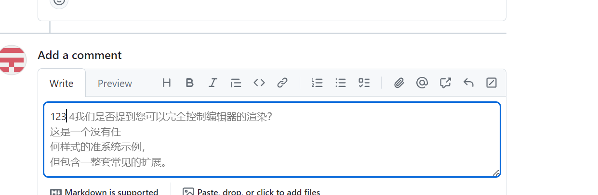
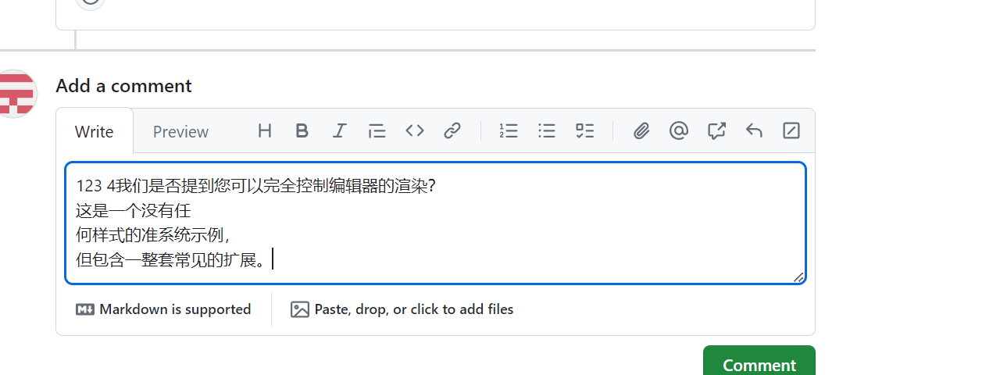
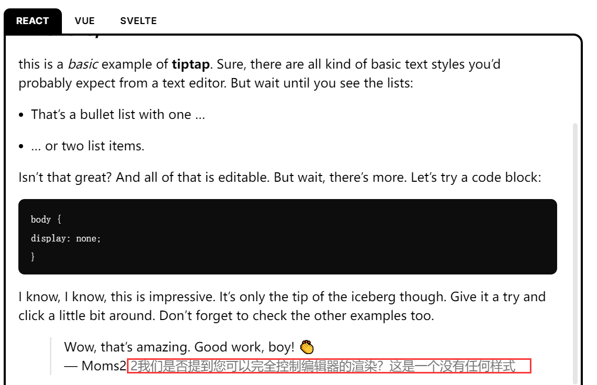
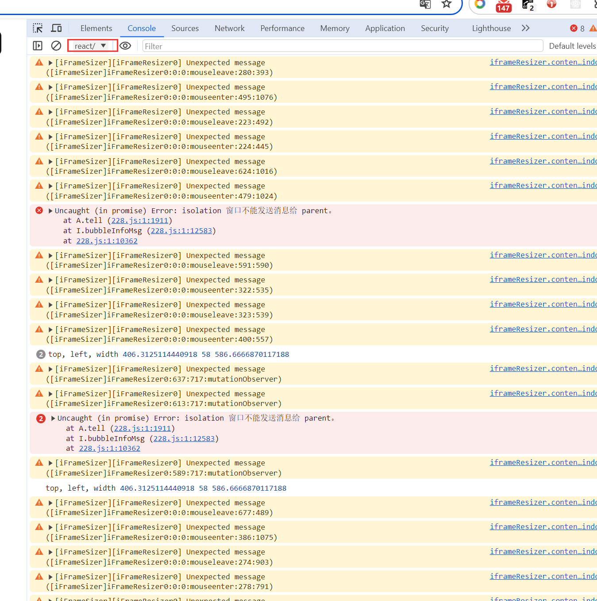

# 智能提示工具使用

1. 源码在src[src](src)目录下实现如下功能
    1. 输入框的最后输入文字会启动提示功能，请求的文字如下规则:
       textarea输入框根据最后换行符号, 句号,分号截取; 可编辑div获取光标这文本节点作为文字
    2. 有智能提示后按tab建选取这个提示，并且光标会定位到最后面
2. 例子在[example](example)，一个是textarea的例子，一个是可编辑div例子
3. 运行例子需要执行如下命令
   ```shell
   yarn build
   yarn link
   yarn devServer
   cd example/textarea
   yarn dev
   ```
4. smart-compose.js文件全局导出window.smartCompose方法

# 实现实现的功能

## textarea输入框智能提示

1. 在 github 上运行效果, 提示时
   
2. 按tab选取效果
   
3. 调试方法
    1. 将项目编译出smart-compose.js
    2. 打开github的一个issues页面
    3. 将smart-compose.js文件内容cope到issues页面的控制台
    4. 如下js代码复制到控制台 （将docker其的服务请求改成了本地模拟请求了）
    5. 将如下内容复制到控制台

```javascript
let i = 0;
const textList = [
  " 1我们是否提到您可以完全控制编辑器的渲染？\n这是一个没有任何样式的准系统示例，\n但包含一整套常见的扩展。",
  " 2我们是否提到您可以完全控制编辑器的渲染？\n这是一个没有任何样式的准系统示例，",
  " 3我们是否提到您可以完全控制编辑器的渲染？",
  " 4我们是否提到您可以完全控制编辑器的渲染？\n这是一个没有任\n何样式的准系统示例，\n但包含一整套常见的扩展。",
];
// 模拟请求
const getSmartCompose = () => {
  return new Promise(resolve => {
    setTimeout(() => {
      i++;
      resolve(textList[i % 4]);
    }, 1000);
  });
};
// textarea的元素
const textarea = document.querySelector("#new_comment_field")
window.smartCompose({
  el: textarea,
  getCompletionValue: getSmartCompose,
});
```

### 可编辑div智能提示

1. 在tiptap编辑器可以正常运行
2. 调试方法
    1. 将项目编译出smart-compose.js
    2. 打开 https://tiptap.dev/docs/editor/examples/default 页面
    3. 控制台的javascript Context 切换到react 
    4. 将smart-compose.js文件内容复制到issues页面的控制台
    5. 将如下内容复制到控制台

```javascript
let i = 0;
const textList = [
  " 1我们是否提到您可以完全控制编辑器的渲染？\n这是一个没有任何样式的准系统示例，\n但包含一整套常见的扩展。",
  " 2我们是否提到您可以完全控制编辑器的渲染？\n这是一个没有任何样式的准系统示例，",
  " 3我们是否提到您可以完全控制编辑器的渲染？",
  " 4我们是否提到您可以完全控制编辑器的渲染？\n这是一个没有任\n何样式的准系统示例，\n但包含一整套常见的扩展。",
];

const getSmartCompose = text => {
  return new Promise((resolve, reject) => {
    setTimeout(() => {
      i++;
      resolve(textList[i % 4]);
    }, 1000);
  });
};
window.smartCompose({
  // 智能提示的偏移量
  offset: [0, -2],
  // 是否清除提示中的换行符号
  clearLine: true,
  // 可编辑的div元素
  el: document.querySelector('.tiptap'),
  // 获取提示文字的远程方法
  getCompletionValue: getSmartCompose,
});
```

## 说明

### textarea

实现原理: 在textarea元素上创建了一个div,复制textarea元素的样式，将textarea中的文字实时同步到这个div中，拼接成如下格式

```html

<div>
  <span>{textarea中的文字}</span>
  {智能提示的文字}
</div>
```

### 可编辑div

探索方法:

1. 直接修改节点：由于有dom结构，直接在光标的后面实时创建一个span加上样式，span里面显示提示的文字。经验证有些编辑其无法实现特别是有远程编辑个功能（通过某些机制限制（可能是MutationObserver），不允许外部脚本修改dom结构，要是修改了，会马上还原（例如：tiptap,
wangeditor等），要实现需要使用编辑器提供的api进行插入，<br />
这样会有如下问题: <br />
1.通过脚本插入无法获取到编辑器的实例<br /> 
2.增加对接成本，<br />
3.有些编辑器有回退功能，会增加一个回退的节点
2. 使用 tooltip 原理实现:
   在鼠标光标的后面插入一个空的span获取这个span的位置，和他的父节点的信息后马上删除掉这个span，这样tooltip的位置信息就有了
